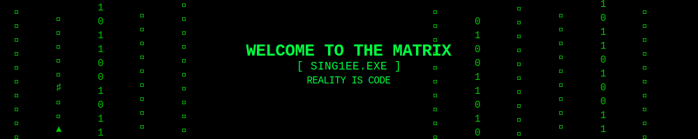

  

<h1 align="center">
  <pre>Wake up, Neo...</pre>
</h1>

  > Accessing Mainframe: <b>[ sing1ee ]</b> 
  > Identity: <b>MILO</b> 
  > Status: <b>[ Operator ]</b>

 

  
<b>>./access-stats.sh</b>

  

    
    
  

 

<h2 align="center">
  <b>SYSTEM.OUT.PRINTLN("Side_Projects.jar");</b>
</h2>

  My side projects are my playground. A place to experiment and build.
   
  <a href="SIDE_PROJECTS.md">> java -jar Side_Projects.jar</a>

 

<h2 align="center">
  <b>ESTABLISH_CONNECTION.EXE</b>
</h2>

  
  

 

  

 

  <pre>There is no spoon.</pre>

